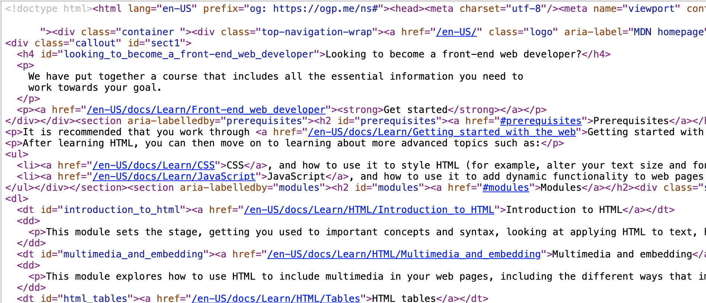
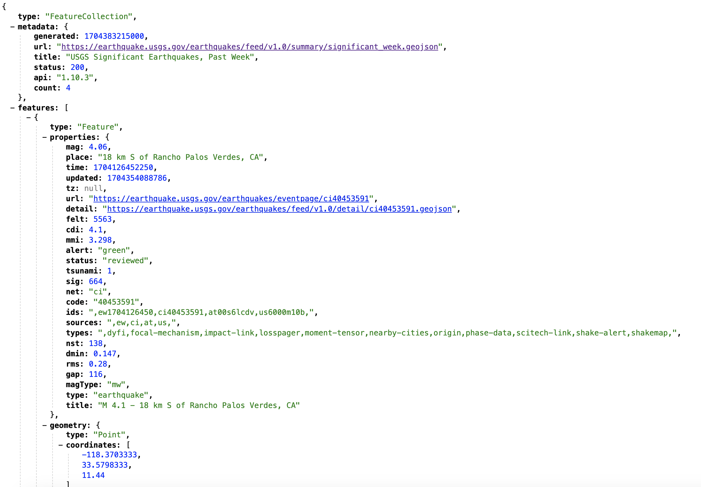
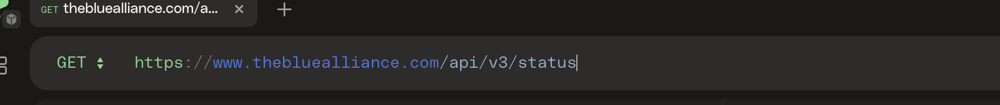
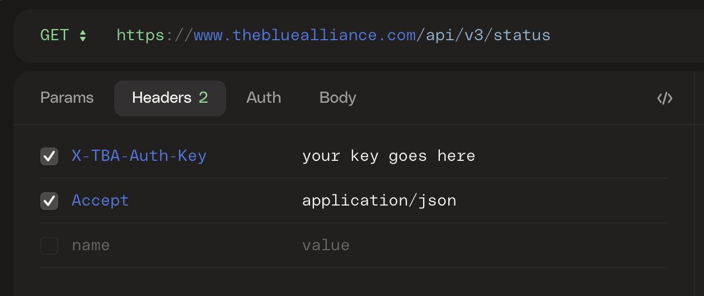
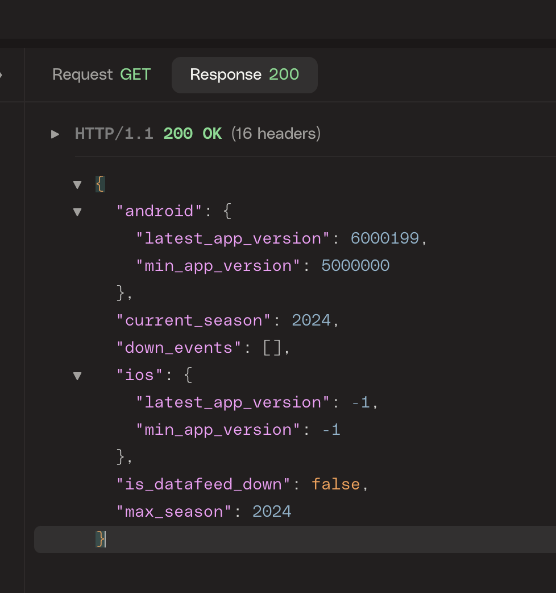

# Rest API Tutorial

## Concepts

### Web

A Simplified view of the web is that everything is either a client or a server.  
The browser is the client and the page you are loading is a server.

When your browser loads a page it sends a request to a server. After a bunch of complex routing, verification, and yadda yadda yadda the server sends back a buch of text that the represents the page. The text is usually a mix of HTML and Javascript. The browser then renders the page and you are happy.

For example Lets say you wanted to learn about HTML. You would click on this link: https://developer.mozilla.org/en-US/docs/Learn/HTML

The server will send back a response that looks like this:

**Reference**: [How the web works](https://developer.mozilla.org/en-US/docs/Learn/Getting_started_with_the_web/How_the_Web_works)

## Other Types of data

HTML works great for the content of a website. However HTML will not work for getting data. It is simply not designed for that.

Let's say you are a robotics team and you want to be able to keep track of how all your compitition is doing throughout the season. To do this you need the results of each and every match those teams play. A nice website that shows all of this data is avaiable. You and your team need that compentive edge adn want to use the data in a different way.

You need the data represented in a diffrent way. That is where Representational State Transfer (REST) comes in.

## REST the browser of data

RESTful APIs leverage the well built and established client server structure a brower uses (HTTP), but for data.

Lets look at an example.

There is a REST [api that gives us data on earthquakes](https://earthquake.usgs.gov/earthquakes/feed/v1.0/geojson.php)

One endpoint will give us the data for significant earthquakes for the past 7 days:

https://earthquake.usgs.gov/earthquakes/feed/v1.0/summary/significant_week.geojson

If you click on this in your browser it will return a representation of this data. Example:

This is not a pretty web page, but is much more suited for an application to be able to use.

## Not just for fetching

REST apis are not just for getting data either. They are structured so that you can add, update, and delete data as well.

To do this there is often a common pattern that you would follow.

The HTTP protocol that your browser uses has multiple Methods that it uses in communication. So far we have only seen a GET method. This method is always used to retrieve information from a server.

However there are other methods that can be used to send data. For isntance when you login to a website with a username and password you might be using a POST method to send that data.

RESTful apis use each of these different methods for a different purpose.

**Ref:** [HTTP Methods in REST APIs](https://www.restapitutorial.com/lessons/httpmethods.html)

## Using REST to represent the full lifecycle of data

Going back to the example of robot compitition. If you were the owner of that data you would need a way to add the details for each event.

In this case the Event is the `resource` that we are representing and in REST each `resource` should have its own set of representaion `endpoint`s.

An `endpoint` is a `URI` that represents a unique resource or set of resources.

For example if there is a match at The Best High School on April 8th of 2024, then the endponit could be `api.exmaple-robots.com/matches/TBHS_05_05_2024`

If you sent a `GET` request to this `URI` you would get back the details for that match.

Then to get teh details for all the matches the URI might be `api.example-robots.com/matches` Sending a `GET` request here would give you the list matches.

If you wanted to add a new match you could send a `POST` request to teh `URI` `api.example-robots.com/matches` and include the data that represents thew new match.

If you wanted to update the information about the match you would send a `PUT` request to the `URI` `api.exmaple-robots.com/matches/TBHS_05_05_2024` and include the updated data that represents the match.

## Using a Real API

Lets start looking at a real api.

We will look at [The Blue Alliance API](https://www.thebluealliance.com/apidocs)

### Installation of tools.

A good way to start it to use an API client tool. There are plenty of options.

- [Postman](https://www.postman.com/downloads/)
- [Insomnia](https://insomnia.rest/download)
- [HTTPie](https://httpie.io/app)

### Getting setup with Blue Alliance

First you need to get access to the blue alliance's api. This requires and authentication key.

To get this follow the instrucions [here](https://www.thebluealliance.com/apidocs) under **Authentication**.

Once you have a `X-TBA-Auth-Key` you are ready to use this api.

### Making some calls

[The full docs for the blue alliance api](https://www.thebluealliance.com/apidocs/v3)

Using HTTPie](https://httpie.io/app)

#### CAll Status

To make sure you have this setup correctly try the status endpoint.

In your open request tab select `GET` and enter the uri: `https://www.thebluealliance.com/api/v3/status`

Add 2 headers

- `X-TBA-Auth-Key`: `<fill in your key>`
- `Accept`: 'application/json'

Click **Send** Button.

You should see a response similar to this:

Lets Break this down.

Request was a `GET` request and the `Response` was a `200`.

For every request you make to a REST API you will get a response code. Each code means something different. As a quick overview:

- 200 level codes mean success
- 400 level codes mean there was an issue with your request
- 500 level codes mean there was an issue on the server.

**Ref**: [Status Code Reference](https://www.restapitutorial.com/httpstatuscodes.html)

In the main section you will see a JSON payload as the body of your response. This is the representation of the current status of the API.

If you got a 200 response, you are all set.
